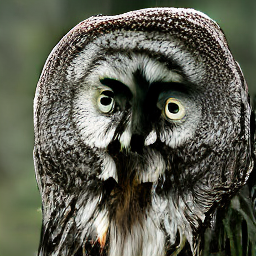
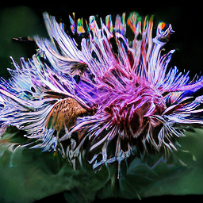
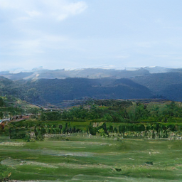

<div align="center">

# Adversarial Distillation of Generative Models
### A Unified View via Stochastic Interpolants

[](Universal_Distillation_For_Stochastic_Interpolants.pdf)
[](SiT/LICENSE.txt)
[](https://pytorch.org/)

Industrial Immersion Project at [AIRI](https://airi.net/)

*One distillation loss to rule them all: diffusion, flow matching, and bridge matching are the same game.*

<table>
<tr>
<td align="center"><b>Teacher (250 steps)</b></td>
<td align="center"><b>Student (1 step)</b></td>
<td align="center"><b>Teacher (250 steps)</b></td>
<td align="center"><b>Student (1 step)</b></td>
</tr>
<tr>
<td></td>
<td></td>
<td></td>
<td></td>
</tr>
</table>

*ImageNet 256x256 SiT-S/2 &mdash; 250-step teacher vs 1-step distilled student*

</div>

---

## TL;DR

> Diffusion, flow matching, and bridge matching look like different algorithms --- but they are all instances of a **Stochastic Interpolant**. This means their adversarial distillation losses are also instances of a single formula. Plug in the schedule, get your distillation for free.

We derive the **Interpolant Generalisation Gap**, a universal adversarial objective, and distill multi-step SiT teachers into **one-step** students on ImageNet 256x256.

---

## Method at a Glance

**One framework.** Every popular generative family connects data $x_0$ and reference $x_1$ via:

$$x_t \;=\; \alpha_t\, x_0 \;+\; \beta_t\, x_1 \;+\; \gamma_t\, z, \qquad z \sim \mathcal{N}(0, I)$$

| Family | $\alpha_t$ | $\beta_t$ | $\gamma_t$ | $p_1$ |
|:---|:---:|:---:|:---:|:---:|
| Flow Matching | $1-t$ | $t$ | $0$ | $\mathcal{N}(0,I)$ |
| VP Diffusion | $\sqrt{\bar\alpha_t}$ | $\sqrt{1-\bar\alpha_t}$ | $0$ | $\mathcal{N}(0,I)$ |
| Bridge Matching | $1-t$ | $t$ | $\sqrt{t(1-t)}$ | *any* |

**The distillation loss.** A student $G_\theta$ generates in one shot. A critic $v_\psi$ adapts to the student's distribution. The stable cross-term loss is:

$$\mathcal{L}_{\text{cross}}(\theta, \psi) \;=\; -2\,\mathbb{E}\Big[\big\langle v^*(x'_t, t) - v_\psi(x'_t, t),\;\dot{I}'_t\big\rangle\Big]$$

Minimise over $\theta$, maximise over $\psi$ --- done.

---

## Architecture

```
                    z ~ N(0,I)
                        |
                   [ G_theta ]  <-- one-step student (generates x'_1)
                        |
                  x'_1 (fake data)
                   /          \
          [ v* (teacher) ]   [ v_psi (critic) ]
               |                    |
           L_star              L_psi
               \                /
                \              /
             Gap = L_star - L_psi   -->  cross-term loss
```

---

## Results

<table>
<tr>
<td align="center" width="50%">

**Fashion-MNIST**

Teacher (50 steps) vs Student (1 step)

</td>
<td align="center" width="50%">

**ImageNet 256x256 &mdash; SiT-S/2**

| | Steps | FID |
|:---|:---:|:---:|
| Teacher | 250 | 61.5 |
| **Student** | **1** | **59.8** |

</td>
</tr>
</table>

> The 1-step student slightly **outperforms** the 250-step teacher, likely due to the adversarial signal.

---

## Repository Structure

```
.
├── README.md
├── Universal_Distillation_For_Stochastic_Interpolants.pdf
├── SI_FM_distill.ipynb     # Self-contained notebook: train + distill on Fashion-MNIST
├── images/                 # Result samples (teacher vs student)
└── SiT/
    ├── models.py           # SiT transformer (S/2 .. XL/2)
    ├── train.py            # Teacher training (DDP)
    ├── distill_ddp.py      # Adversarial distillation (DDP)
    ├── sample.py           # Single-GPU sampling
    ├── sample_ddp.py       # Multi-GPU sampling + FID eval
    ├── transport/
    │   ├── transport.py    # training_losses() + distillation_loss()
    │   ├── path.py         # Interpolant paths (Linear, GVP, VP)
    │   └── integrators.py  # ODE / SDE solvers
    ├── environment.yml
    └── run_SiT.ipynb       # Colab demo
```

---

## Quick Start

### 1. Setup

```bash
cd SiT
conda env create -f environment.yml
conda activate SiT
pip install diffusers transformers accelerate
```

### 2. Train a Teacher (or use a pretrained one)

```bash
torchrun --nnodes=1 --nproc_per_node=N train.py \
    --model SiT-S/2 \
    --data-path /path/to/imagenet/train \
    --image-size 256 \
    --global-batch-size 256
```

Pretrained SiT-XL/2 (FID 2.06) is available --- see [`SiT/README.md`](SiT/README.md) for the download link.

### 3. Distill into a One-Step Student

```bash
torchrun --nnodes=1 --nproc_per_node=N distill_ddp.py \
    --model SiT-XL/2 \
    --teacher_ckpt /path/to/teacher_ema.pt \
    --batch 128 \
    --iters 200000 \
    --lr 1e-5 \
    --cfg_scale 4.0 \
    --k_psi 5 \
    --k_G 1
```

### 4. Sample (1 NFE)

Load the student checkpoint and run a single forward pass --- no ODE/SDE integration required.

---

## Distillation Arguments

| Argument | Default | Description |
|:---|:---:|:---|
| `--model` | *required* | SiT variant (`SiT-XL/2`, `SiT-S/2`, ...) |
| `--teacher_ckpt` | *required* | Path to pretrained teacher `.pt` |
| `--batch` | `128` | Per-GPU batch size |
| `--iters` | `200000` | Total training iterations |
| `--lr` | `1e-5` | Learning rate (critic + generator) |
| `--cfg_scale` | `4.0` | Classifier-free guidance scale |
| `--k_psi` | `5` | Critic updates per iteration |
| `--k_G` | `1` | Generator updates per iteration |
| `--sample_every` | `5000` | W&B image logging interval |

Checkpoints are saved every 1,000 steps as `student_one_step_XXXXXXX.pth`.

---

## References

1. Albergo, Boffi, Vanden-Eijnden. *Stochastic Interpolants: A Unifying Framework for Flows and Diffusions*. arXiv:2303.08797, 2023.
2. Ma et al. *SiT: Exploring Flow and Diffusion-based Generative Models with Scalable Interpolant Transformers*. ECCV, 2024.
3. Zhou et al. *Score Identity Distillation*. ICML, 2024.
4. Lipman et al. *Flow Matching for Generative Modeling*. ICLR, 2023.
5. Gushchin et al. *Inverse Bridge Matching Distillation*. arXiv:2502.01362, 2025.

---

<div align="center">
<sub>Built on top of <a href="https://github.com/willisma/SiT">SiT</a> | MIT License</sub>
</div>
